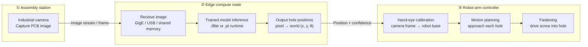
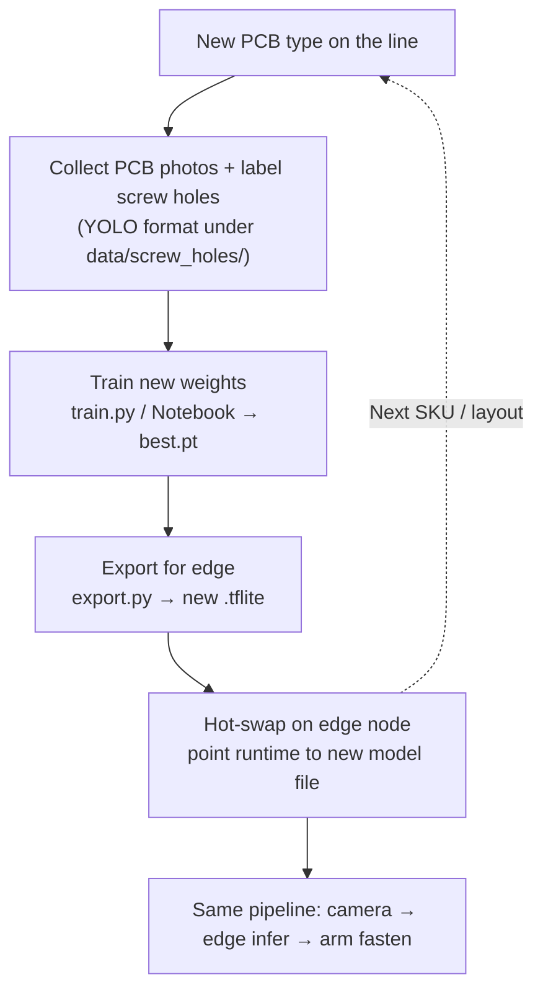
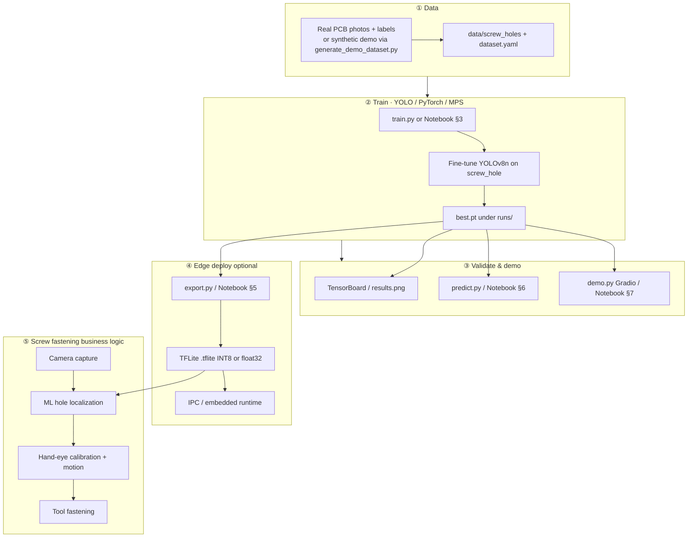
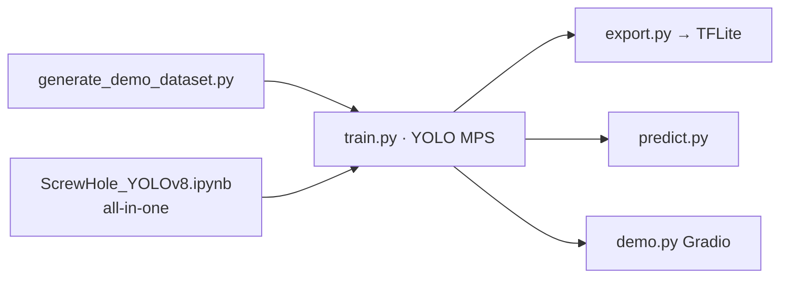

# screw-hole-detector-yolov8

**ML Vision-Guided Screw Fastening**

<p align="center">
  <strong>English</strong> · <a href="README_zh.md">中文</a>
</p>

---

### What is this project?

An **ML vision-guided screw fastening** demo: **YOLOv8** detects screw holes on PCB images and returns **bounding boxes, hole centers, and confidence scores** for a robot arm pipeline (**align → fasten**), similar to manufacturing visual guidance for automated screw driving.

| Aspect | Detail |
|--------|--------|
| Type | ML object detection (not classical rule-based vision) |
| Model | YOLOv8n (lightweight, MacBook M2 + MPS) |
| Training | **PyTorch / Ultralytics** (not TensorFlow training) |
| Deployment | Optional **TFLite** export for edge inference |
| UX | Jupyter Notebook + Gradio Web Demo |

### Result preview

After training / inference, you get annotated detections in Gradio or the Notebook. Example:

<p align="center">
  
</p>

<p align="center"><sub>Figure: PCB screw-hole detection example (<code>images/img.png</code>)</sub></p>

---

### Production line: camera → edge → robot arm

How this ML screw-fastening stack runs on a real line: the **station camera** captures the PCB, the **edge node** runs the **trained model** to compute hole positions, and the **robot arm** fastens screws using those coordinates.



| Step | Component | Role |
|------|-----------|------|
| 1 | **Station camera** | Photograph the PCB after placement (or before fastening) |
| 2 | **Edge node** | Run the deployed detector; return each screw-hole center and score |
| 3 | **Robot arm** | Transform poses, move the tool, and drive screws into the detected holes |

Typical edge stack: export with `export.py` → load `.tflite` on the IPC / NPU; optional PLC/MES handshake around the position list.

---

### Swapping models for new PCBs

When the line switches to a **new board** (different hole layout or SKU), you **retrain and replace the model** on the edge node—robot motion logic stays the same if hole coordinates are still delivered in the same format.



| Change | What you update | What usually stays |
|--------|-----------------|-------------------|
| New PCB layout | Dataset, `dataset.yaml`, retrain, new `.tflite` on edge | Camera mount, network path, arm fastening sequence |
| Higher accuracy need | More labeled images, epochs, or larger YOLO variant | Overall architecture above |

This repository covers **training and export** (steps D → E); integration with your camera SDK and robot controller is on the factory side.

---

### End-to-end workflow (development)



---

### Scripts & artifacts



| File | Role |
|------|------|
| `ScrewHole_YOLOv8.ipynb` | **Recommended** step-by-step pipeline |
| `generate_demo_dataset.py` | Synthetic PCB + holes for quick trials |
| `dataset.yaml` | Dataset paths & class `screw_hole` |
| `train.py` | Train YOLOv8n with `device=mps` → `best.pt` |
| `export.py` | Convert `best.pt` to `.tflite` |
| `predict.py` | Single-image CLI inference |
| `demo.py` | Gradio UI with boxes & coordinates |
| `images/img.png` | Example final result screenshot |

---

### Project layout

```
screw-hole-detector-yolov8/
├── README.md / README_zh.md
├── ScrewHole_YOLOv8.ipynb
├── images/img.png
├── dataset.yaml
├── train.py · export.py · predict.py · demo.py
├── generate_demo_dataset.py
├── data/screw_holes/
└── runs/                 # gitignored
```

---

### Quick start

```bash
cd ~/Projects/screw-hole-detector-yolov8
python3 -m venv .venv && source .venv/bin/activate
pip install -r requirements.txt

python generate_demo_dataset.py --train 80 --val 20
python train.py --epochs 50 --batch 8
python export.py --no-int8 --device cpu --imgsz 320
python demo.py
```

Open `ScrewHole_YOLOv8.ipynb` and run cells top to bottom. For export on Mac, prefer `EXPORT_INT8 = False` and `device=cpu` in the Notebook to avoid long silent TensorFlow conversion.

---

### Dataset layout (YOLO)

```
data/screw_holes/
├── images/train/   images/val/
└── labels/train/   labels/val/
```

---

### Training vs TensorFlow

| Stage | Stack |
|-------|--------|
| Train / `.pt` inference | **YOLOv8 + PyTorch** (MPS on Apple Silicon) |
| `.tflite` export | **TensorFlow** via Ultralytics converter & quantization |

---

### FAQ

- **Missing `best.pt`**: Check nested path `runs/detect/runs/detect/...` or use `find_best_pt()` in the Notebook.
- **TFLite export seems stuck**: Usually CPU conversion; try `--no-int8` first.
- **Very high mAP on synthetic data**: Expected for demo data; retrain on real PCB labels for production.

---

### License

Demo / educational use. YOLOv8 follows [Ultralytics AGPL-3.0](https://github.com/ultralytics/ultralytics).

---

<p align="center"><a href="README_zh.md">中文文档 →</a></p>
