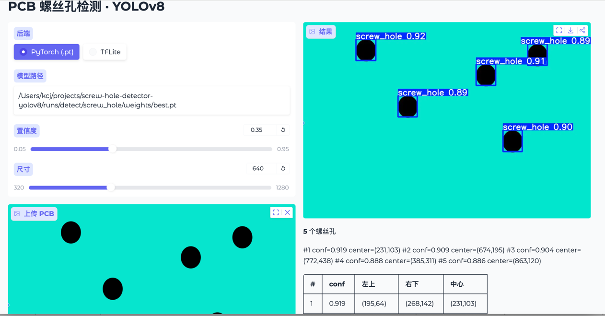
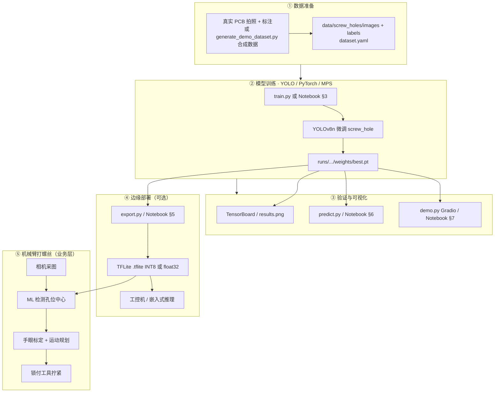
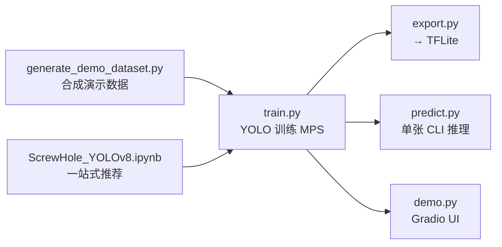

# screw-hole-detector-yolov8

**ML 视觉引导打螺丝**

<p align="center">
  <a href="README.md">English</a> · <strong>中文</strong>
</p>

---

### 项目是什么？

这是一个 **机器学习（ML）打螺丝** 演示项目：用 **YOLOv8** 在电路板（PCB）图像上检测螺丝孔位置，输出每个孔位的 **边界框、中心坐标、置信度**，供视觉引导机械臂完成 **对准 → 锁付**（模拟产线视觉引导锁螺丝流程）。

| 项目定位 | 说明 |
|----------|------|
| 类型 | ML 目标检测（非传统规则视觉） |
| 模型 | YOLOv8n（轻量，适合 MacBook M2 + MPS） |
| 训练栈 | **PyTorch / Ultralytics**（不是 TensorFlow 训练） |
| 部署 | 可导出 **TFLite** 给边缘设备推理 |
| 交互 | Jupyter Notebook + Gradio Web Demo |

### 检测结果示意

训练 / 推理完成后，可在 Gradio 或 Notebook 中得到带框的检测结果。示例截图：

<p align="center">
  
</p>

<p align="center"><sub>图：PCB 螺丝孔检测示例（<code>images/img.png</code>）</sub></p>

---

### 整体工作流程

从数据到产线部署的完整链路如下。



---

### 脚本 / 文件分工



| 文件 | 作用 |
|------|------|
| `ScrewHole_YOLOv8.ipynb` | **推荐**：按章节完成环境、数据、训练、导出、预测、Demo |
| `generate_demo_dataset.py` | 无真实数据时，本地生成合成 PCB 螺丝孔数据集 |
| `dataset.yaml` | YOLO 数据集路径与类别 `screw_hole` |
| `train.py` | YOLOv8n 训练，`device=mps`，输出 `best.pt` |
| `export.py` | 将 `best.pt` 转为 `.tflite`（INT8 或 float32） |
| `predict.py` | 命令行单图检测 |
| `demo.py` | Gradio：上传图 → 框 + 孔位坐标表 |
| `images/img.png` | 最终结果示例截图 |

---

### 项目结构

```
screw-hole-detector-yolov8/
├── README.md / README_zh.md
├── ScrewHole_YOLOv8.ipynb
├── images/img.png
├── dataset.yaml
├── train.py · export.py · predict.py · demo.py
├── generate_demo_dataset.py
├── data/screw_holes/
└── runs/                 # git 忽略
```

---

### 快速开始

```bash
cd ~/Projects/screw-hole-detector-yolov8
python3 -m venv .venv && source .venv/bin/activate
pip install -r requirements.txt

# 无标注数据时：生成演示集
python generate_demo_dataset.py --train 80 --val 20

# 训练（YOLO + MPS）
python train.py --epochs 50 --batch 8

# 快速导出 TFLite（float32，较快）
python export.py --no-int8 --device cpu --imgsz 320

# Gradio Demo
python demo.py
```

**Notebook：** 打开 `ScrewHole_YOLOv8.ipynb`，从上到下运行；导出章节默认 `EXPORT_INT8 = False`、`device=cpu`，避免 Mac 上 TensorFlow 长时间无输出。

---

### 数据集目录（YOLO 格式）

```
data/screw_holes/
├── images/train/   images/val/
└── labels/train/   labels/val/    # 与图片同名的 .txt
```

---

### 训练 vs TensorFlow

| 阶段 | 技术 |
|------|------|
| 训练 / `.pt` 推理 | **YOLOv8 + PyTorch**（M2 用 MPS） |
| `.tflite` 导出 | Ultralytics 调用 **TensorFlow** 做格式转换与量化 |

---

### 常见问题

- **`best.pt` 找不到**：权重可能在 `runs/detect/runs/detect/screw_hole/...`；Notebook 已用 `find_best_pt()` 自动查找，或见 `runs/detect/screw_hole/weights/best.pt`。
- **导出 TFLite 日志停住**：多为 CPU 转换中，非报错；可先 `export.py --no-int8`。
- **合成数据指标很高**：仅说明流程通畅；产线请换真实 PCB 标注重训。

---

### 许可证

Demo / 学习用途。YOLOv8 遵循 [Ultralytics AGPL-3.0](https://github.com/ultralytics/ultralytics)。

---

<p align="center"><a href="README.md">English documentation →</a></p>
